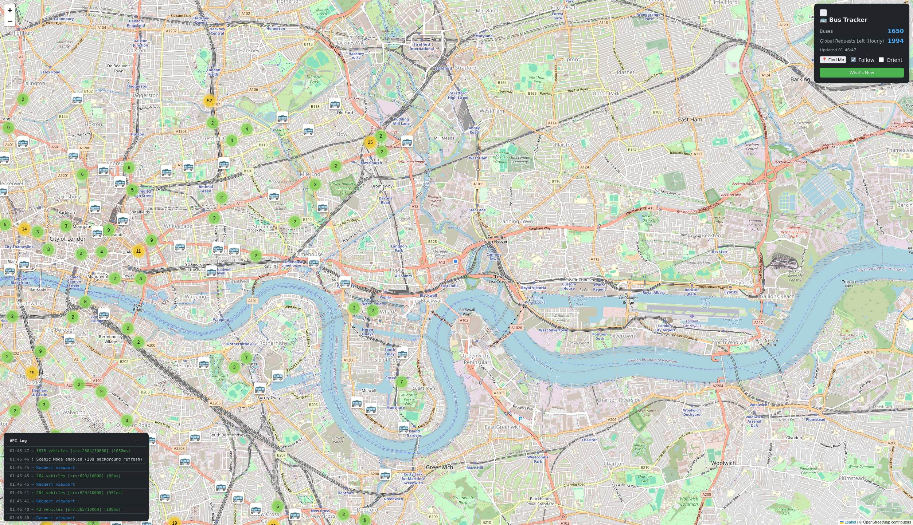

# Bus Tracker

This project uses data from UK [Bus Open Data Service (BODS)](https://data.bus-data.dft.gov.uk/)
to produce a near real-time map. 



## Features
- Near-real time bus map covering the UK.
- Client behaviour adjustment based on zoom level & vehicle volume. Geolocation, following, orientation.
- Early affordances for small screens, like the ability to minimise UI elements.
- Client-level and global rate limits to discourage malicious use.
- Back-end API gateway for BODS/OSRM/ADSB/Cap requests, for protection of sensitive data.
- Hosting in Docker via Tailscale Funnel, to make deployment on commodity hardware easy.
- .env environment configuration (mostly - some internal stuff still needs cleaning up!)
- Optional street-level routing predictions based on OpenStreetMap data (via secondary container.)
- Optional live aircraft overlay (you'll need a source of ADSB data)
- Distinct icons courtesy of tar1090, and aircraft route data from ADSB.lol

# How? Why?
I'm just a sucker for visualising real-time data that reflects the real world.
I've long thought about it, but finally put some time in to make a cool thing, I guess!

The content of the earliest commit was outlined over a couple of sleepless weekends 
in December of 2015, and Claude was used heavily early on. 

I was asked by some friends to publish the code after early demos, so I've reluctantly 
done so in spite of it being a bit of an AI fever dream. My intent now is to improve on what 
exists by hand - I've seen what happens when Claude is asked to "improve" things. 
Way too much boilerplate. Unlike that early software, this was written entirely manually. <3

A few days work has already gone into polish, and a few hours into prepping this for release.
There are still plenty of rough edges, though. Caveat emptor. 

# Licence, attributions & thanks
This "weekend" project was only possible because others are solving harder problems 
and choosing to  publish their software under open licences.

My thanks to anyone whose support got things off the ground, and to those whose
GPL contributions undoubtedly fed the LLM that saved my hands from drudgery.

The following people and projects get a special mention for one reason or another:
- [johnrobharrison](https://github.com/johnrobharrison/) for encouraging me in my first 
steps with RTL-SDR and embedded hardware in particular.
- [Sacro](https://github.com/Sacro/) and [johnrobharrison](https://github.com/johnrobharrison/) for their encouragement, generally.
- [wiedehopf](https://github.com/wiedehopf), for his excellent tar1090 fork and aircraft icons;
- the [sdr-enthusiasts](https://github.com/sdr-enthusiasts) community for [docker-adsb-ultrafeeder](https://github.com/sdr-enthusiasts/docker-adsb-ultrafeeder);
- [adsb.im](https://adsb.im) for making ADSB accessible to so many.

This project is hereby licenced under the GPLv3, the full text of which can be found in [LICENSE.md](./LICENSE.md)
(misspelt for Github) or online at [https://www.gnu.org/licenses/gpl-3.0.txt](https://www.gnu.org/licenses/gpl-3.0.txt).

Relevant licence information has been collated below on a best-effort basis.
Feel free to contact me if needed.

# Third-party projects & commercial services
| Name | Service Type | Licence | Licence URL |
|------|-------------|---------|------------|
| OpenStreetMap Routing Machine (OSRM) | Routing Engine | BSD 2-Clause | [Link](https://github.com/Project-OSRM/osrm-backend) / [Image](https://github.com/project-osrm/osrm-backend/pkgs/container/osrm-backend) |
| Cap Standalone | CAPTCHA Engine (Back-end) | Apache-2.0 | [Docs](https://capjs.js.org/guide/standalone/) / [Github](https://github.com/tiagozip/cap) |
| Tailscale | VPN Service | Mixed (Client: BSD 3-Clause, Service: Commercial) | [Open Source](https://tailscale.com/opensource) / [Client](https://github.com/tailscale/tailscale) |
| tar1090 | Aircraft Tracking Visualisation | GPL v2 or later | [Github](https://github.com/wiedehopf/tar1090) |
| ADS-B.im | Probably the easiest turnkey RTLSDR-ADSB feeder around | - | [Website](https://globe.adsb.im/) |
| ADS-B.lol | Provide a great REST API to contributors | Community Project | [Website](https://adsb.lol/) |
| SDR Enthusiasts Ultrafeeder | ADS-B Data Collection & Feeding | GPL-3.0 | [Github](https://github.com/sdr-enthusiasts/docker-adsb-ultrafeeder) |

# Software dependencies
## Python
| Name | Version | Licence | Licence URL |
|------|---------|--------|------------|
| defusedxml | 0.7.1 | Python Software Foundation Licence | [Link](https://docs.python.org/3/license.html) |
| Flask | 3.1.2 | BSD-3-Clause | [Link](https://flask.palletsprojects.com/en/stable/license/) |
| python-dotenv | 1.2.1 | BSD-3-Clause | [Link](https://github.com/theskumar/python-dotenv/blob/main/LICENSE) |
| requests | 2.32.5 | Apache-2.0 | [Link](https://www.apache.org/licenses/LICENSE-2.0) |

## JavaScript
| Name | Version | Licence | Licence URL |
|------|---------|--------|------------|
| Leaflet | 1.9.4 | BSD 2-Clause | [Link](https://github.com/Leaflet/Leaflet/blob/main/LICENSE) |
| Leaflet.markercluster | 1.5.3 | MIT | [Link](https://github.com/Leaflet/Leaflet.markercluster/blob/master/MIT-LICENSE.txt) |
| tar1090 markers.js | N/A | GPL v2 or later | [Link](https://github.com/wiedehopf/tar1090/blob/master/LICENSE) |
| Cap.js | N/A | Apache-2.0 | [Link](https://github.com/CosmicDustTinCan/capjs) |

## Can I use it myself?
Sure! 
- You'll need a BODS API Key. Register for one at [https://data.bus-data.dft.gov.uk/account/signup/](https://data.bus-data.dft.gov.uk/account/signup/).
- You may want a Tailscale API key, which you can create in your admin panel. Make sure it's good for repeated use.

### Cap Captcha
You may want to set a Cap key, to limit use of your BODS API key: 
1. Launch in docker with `docker compose --profile public up -d --build`
2. Open http://localhost:3000 in browser
3. Log in with the admin key (default: `changeme`, or whatever you set `CAP_ADMIN_KEY` to in `.env`)
4. Click "Create Site Key" in the dashboard
5. Copy the **Key ID** and **Secret** it generates
6. Add to `.env`:
```
   CAP_KEY_ID=<the key id>
   CAP_KEY_SECRET=<the secret>
   CAP_URL=http://cap:3000
   CAP_PUBLIC_URL=http://<your-tailscale-hostname>:3000 
```
### OSRM (Optional)
You may want an OSRM instance, for routing. First you need to preprocess the map data (one-time, ~30min for UK).
Make a `docker-compose.yml` file:

```yaml
 # You will want this *not* on an RPi, at least not yet.
 osrm:
   image: osrm/osrm-backend
   container_name: osrm
   restart: unless-stopped
   ports:
     - "5001:5000"
   volumes:
     - osrm-data:/data
   command: osrm-routed --algorithm mld /data/great-britain-latest.osrm
```
Then, alongside that file, make a folder and prepare the container:

```bash
   mkdir -p osrm-data && cd osrm-data`
   wget https://download.geofabrik.de/europe/great-britain-latest.osm.pbf`
   docker run -t -v $(pwd):/data osrm/osrm-backend osrm-extract -p /opt/car.lua /data/great-britain-latest.osm.pbf`
   docker run -t -v $(pwd):/data osrm/osrm-backend osrm-partition /data/great-britain-latest.osrm`
   docker run -t -v $(pwd):/data osrm/osrm-backend osrm-customize /data/great-britain-latest.osrm`
```

`docker compose up -d` should now start the container.

To test it:
`curl localhost:5001/5001/route/v1/driving/-0.0877,51.5079;-0.0900,51.5100?geometries=geojson"`

Should give you something like:
```json 
   {"code":"Ok","routes":[{"geometry":{"coordinates":[[-0.087641,51.507892],[-0.088322,51.506128],[-0.089951,51.504807],...
```

In the primary `docker-compose.yml`, `extra-hosts` needs `mitre:10.0.0.120` swapping to wherever you are hosting OSRM,
to allow the container to communicate with it.

### Environment
Now, set up the variables in .env.example (as .env)

### Run
Launch in Docker with `docker compose up -d --build` for local access only,
or `docker compose --profile public up -d --build` to include Tailscale and Cap
for public access.

